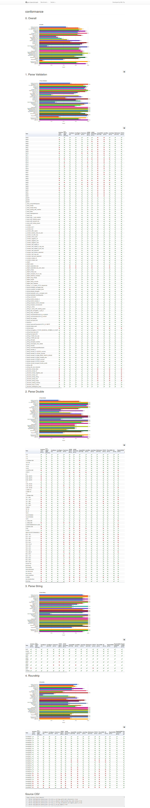

# C,C++ Json benchmarks, conformance check

## based on "Native JSON Benchmark" of Milo Yip (miloyip@gmail.com)

https://github.com/miloyip/nativejson-benchmark

### The results always reflect the latest states

### 40+ libraries benchmarked !!!

[active modules](reports/active_test_names.md)

### Info about JSON parsing

http://seriot.ch/parsing_json.php

1. clone

git clone --recursive https://github.com/styac/cxx-json-benchmark

./checkout_thirdparty.sh

./pull_thirdparty.sh

2. out of source build

./compile.sh

3. cd ../cxx-json-benchmark_build

./json-benchmark

4. cd ../cxx-json-benchmark/result

5. make

6. view

conformance.html

performance_*.html

#### test platform:

- opensuse 15.2

- gcc 9.3

#### test hardware:

- AMD Bulldozer 8 core not too fast settings in BIOS

